# ARSW-Labs

## Compilar y ejecutar

Para compilar: mvn package
Para ejecutar la clase principal: mvn exec:java -Dexec.mainClass="edu.eci.arsw.threads.MainCanodromo"
                                  mvn exec:java -Dexec.mainClass="edu.eci.arsw.primefinder.Main"

# Lab01 (BBP Formula)

Este laboratorio contiene ejercicios de introducción a la programacion en java usando hilos.

1. **Part I - Introducción a hilos en java**

La diferencia entre start() y run() es que al usar start , no espera a que acabe un proceso para ejecutar el siguiente, se sobrepone uno sobre otro, al usar run() realiza el proceso en el orden programado, adicional a esto el metodo start usa 2 hilos de forma concurrente uno que usa el metodo start y el otro usa el metodo run, al llamar rl metodo run, solo se llama a si mismo.

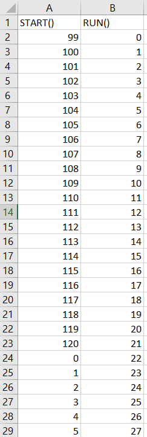

2. **Part II - BBP Formula Exercise**

Se modifico la funcion "PiDigits.getDigits()" para que reciba un parametro N el cual corresponde al numero de hilos en el que se va a dividir la solución de la siguiente forma:

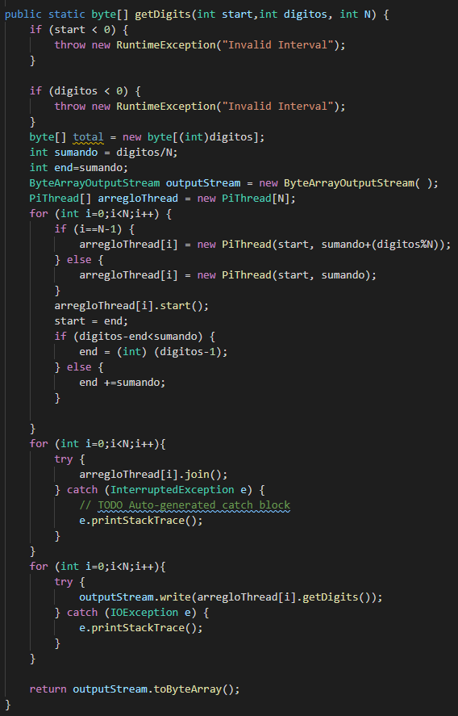

Se realizo la siguiente prueba en la cual se usa de 1 a 3 hilos para general la solución:

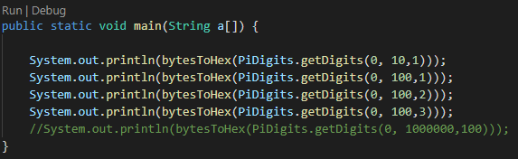

3. **Part III - Performance Evaluation**

  De acuerdo con la ley de Amdahls, donde S (n) es la mejora teórica del rendimiento, P la fracción paralela del algoritmo, y n el número de hilos, cuanto mayor sea n, mayor será la mejora.
  
  - Un solo hilo
  
  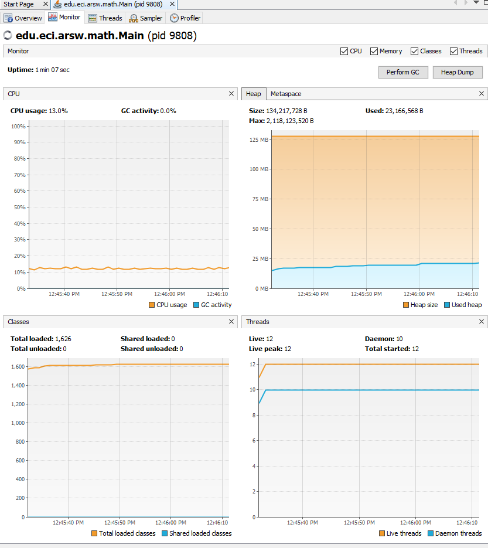
  
  - Numero de cores e hilos
  
  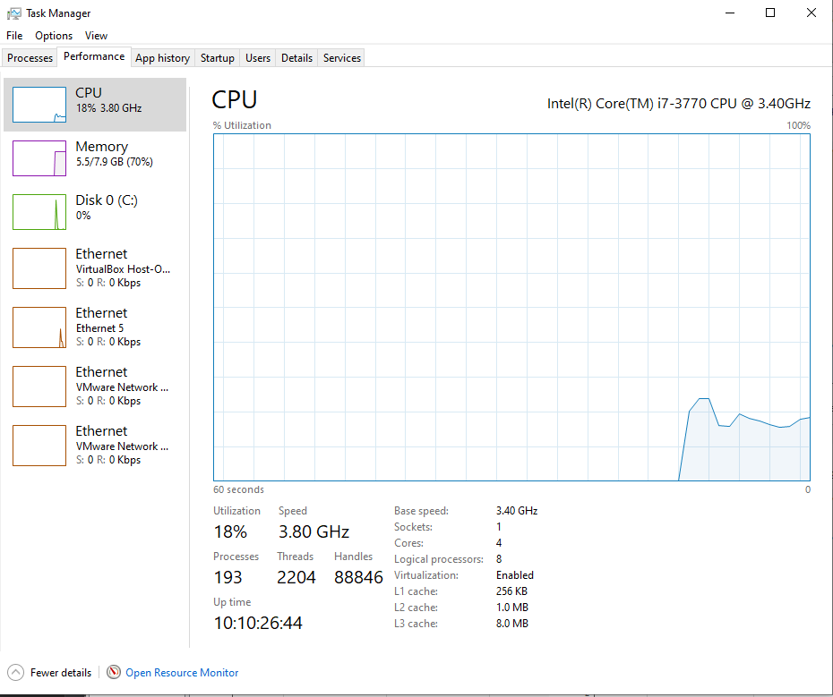
  
  - 200 Hilos
  
  
  
  - 500 Hilos
  
  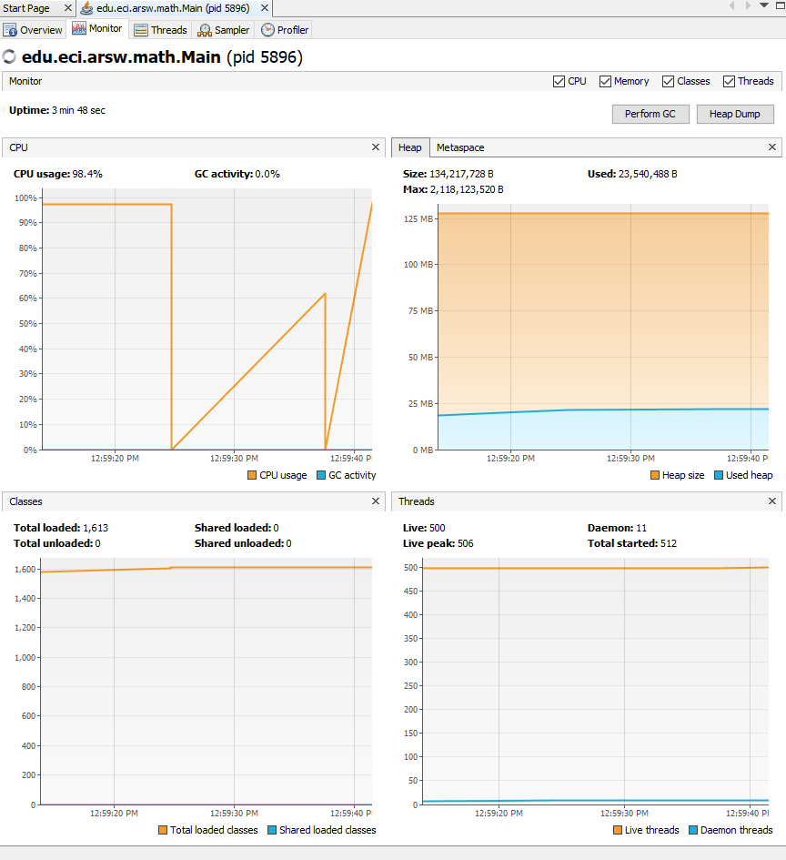
  
  1 - ¿Por qué no se logra el mejor rendimiento con los 500 hilos?, ¿Cómo se compara este rendimiento cuando se usan 200?
  
      - En este caso aunque tengamos mas hilos para trabajar el costo del interleaving y el cambio de contexto hace mas lento el usar 500 hilos a 200
  
  2 - ¿Cómo se comporta la solución usando tantos hilos como núcleos en comparación con el resultado de usar el doble?
  
    - La solución seria optima ya que al usar el doble de hilos que de cores se esta aprovechando la velocidad sin excederse en el uso de hilos.
  
   De acuerdo con lo anterior, si para este problema en lugar de 500 hilos en una sola CPU, se pudiera usar 1 "wire" en cada una de las 500 máquinas hipotéticas.
   
   
  3 - ¿Se aplicaría mejor la ley de Amdahls?, Si, en cambio, se usaran c hilos en 500/c máquinas distribuidas (donde c es el número de núcleos de dichas máquinas), ¿se mejoraría?
  
    - Si seria mejor aplicarlo, con eso se mejora el tiempo respecto al cambio entre hilos. En el segundo caso, 500/c mejoraria el tiempo pero de igual forma se le cargaria mucho al CPU por que se debe contar con el tiempo de cambio entre hilos.
  
    
# Dogs Race case

1. **Part I**

1 - Script

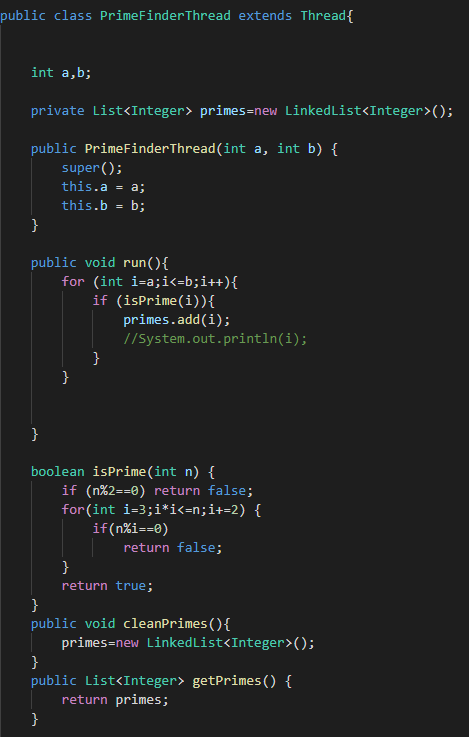

2 - Main

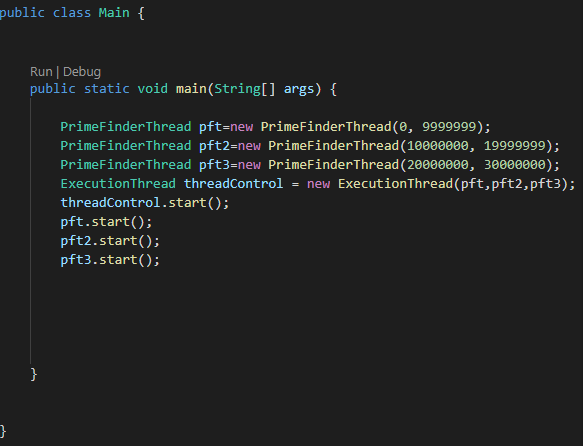

3 - Un solo hilo que busca primos entre 0 y 30,000,000. 

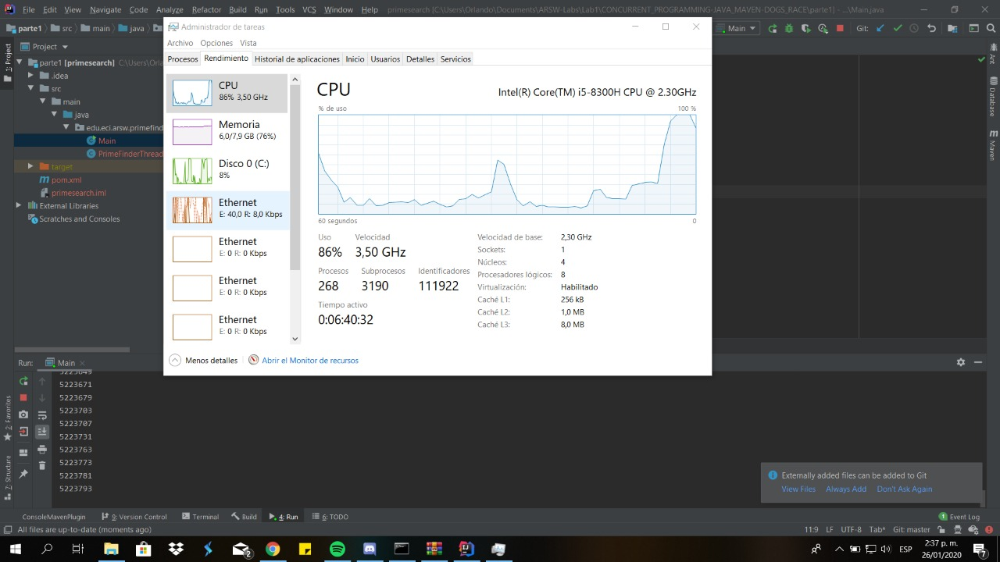

1. **Part III**

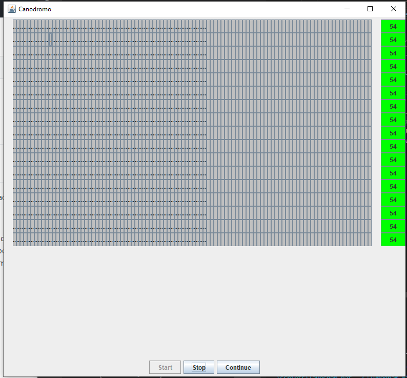

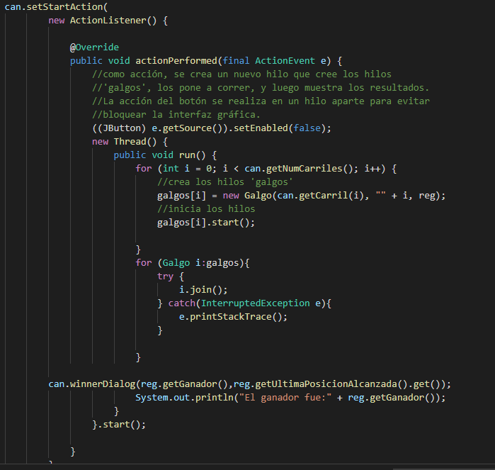

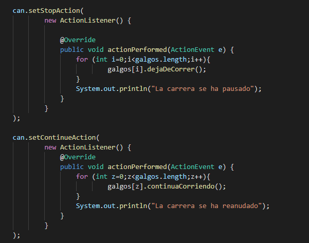

## Desarrollado con:

* [Maven](https://maven.apache.org/) - Dependency Management
* [JAVA](https://www.java.com/es/download) - Framework
* [JDK](https://www.oracle.com/technetwork/java/javase/downloads/jdk8-downloads-2133151.html) - Framework

## Autores:

* **Orlando Antonio Gelves Kerguelen**  [orlandoagk](https://github.com/orlandoagk)
* **Jimmy Andres Moya Suarez**  [Jmjimmy20](https://github.com/Jmjimmy20)

