### Escuela Colombiana de Ingeniería
### Arquitecturas de Software - ARSW

## Autores:

* **Orlando Antonio Gelves Kerguelen**  [orlandoagk](https://github.com/orlandoagk)
* **Jimmy Andres Moya Suarez**  [Jmjimmy20](https://github.com/Jmjimmy20)

## LAB-10

### Descripción
Se realizara en Azure con Redis la memorización de valores usando el programa de Fibonacci, se  visualizara y comparar el rendimiento de los casos.

### Test

### Sin Memorización

- 0

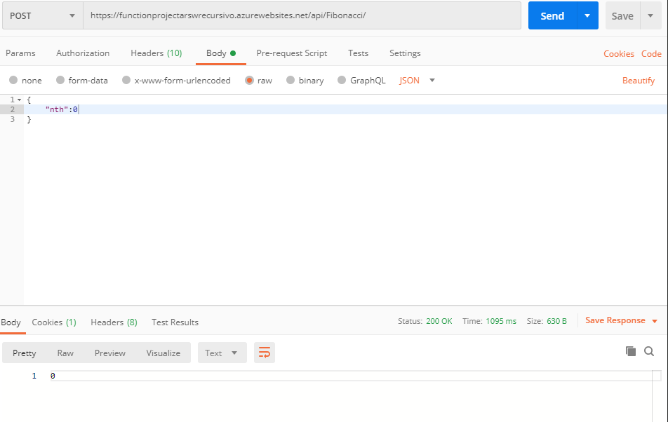

- 100

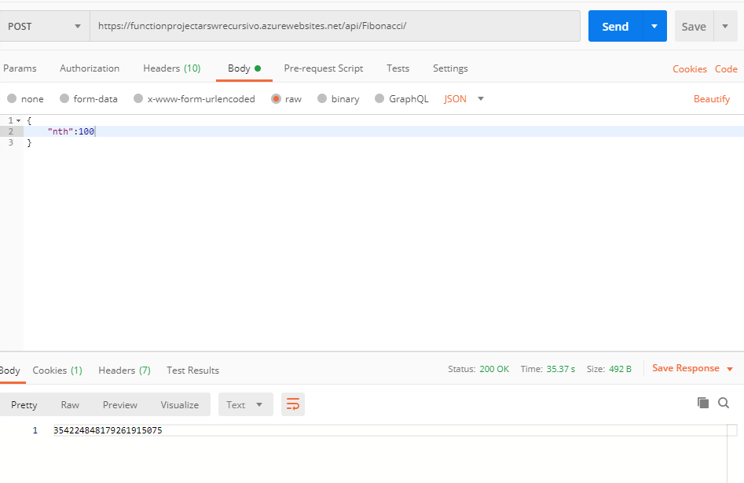

- 500

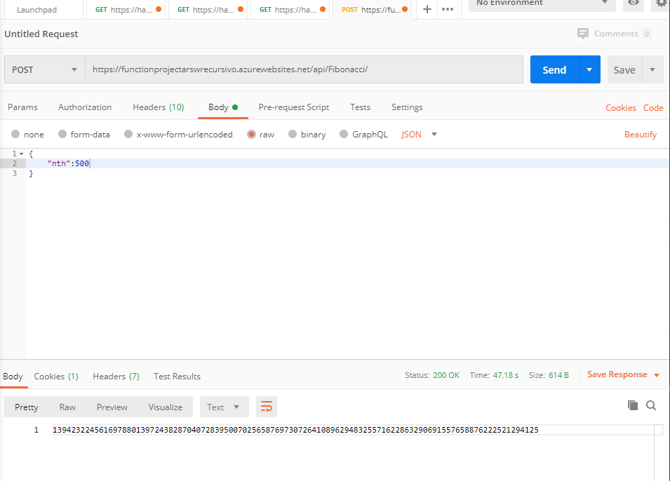

- 1000

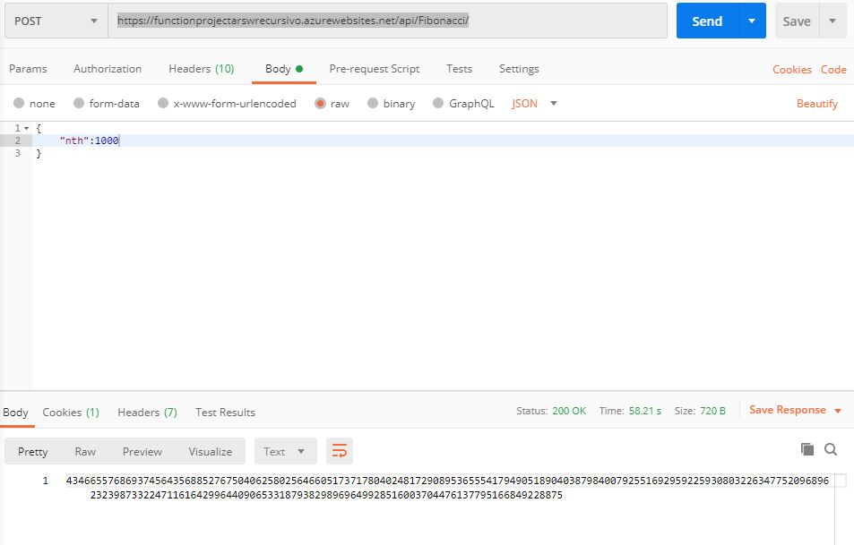

- 2000 

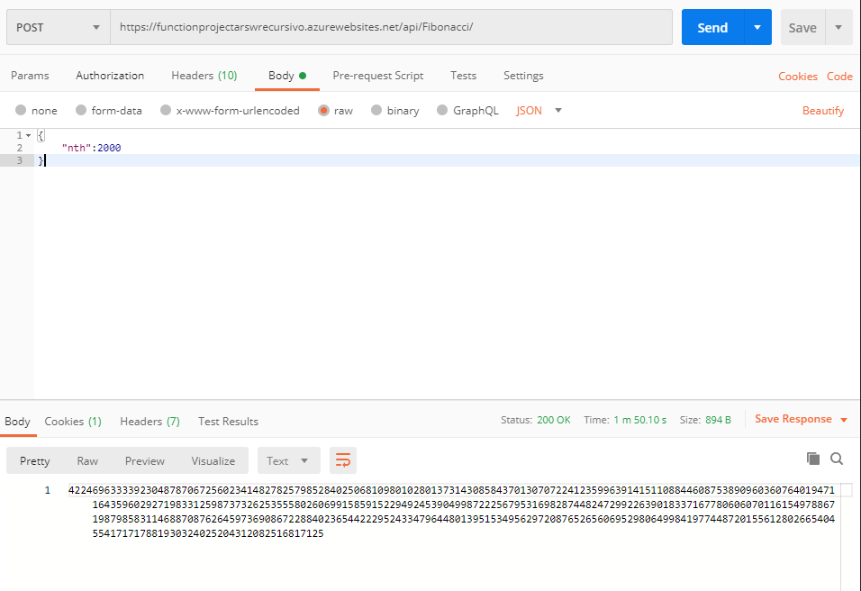

- 5000

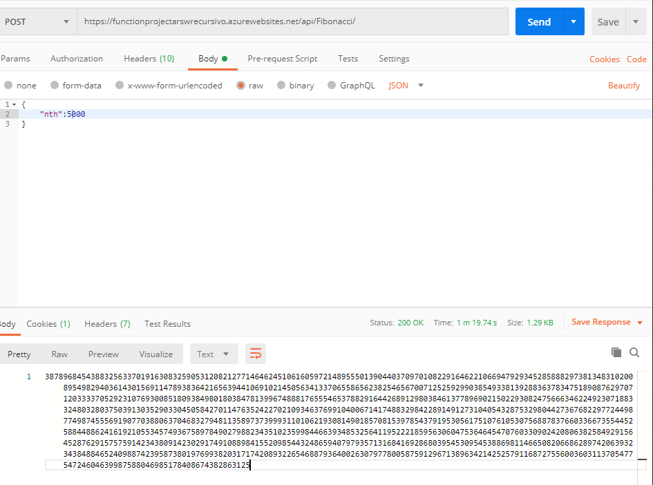

- 10000

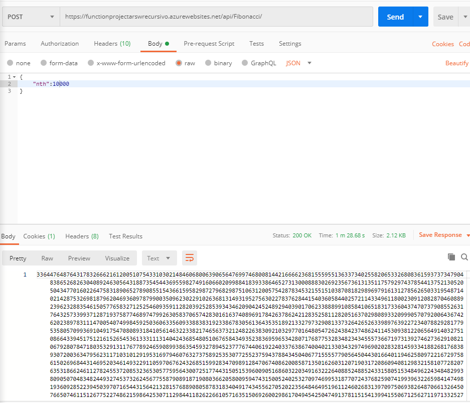

### Con Memorización

- 0

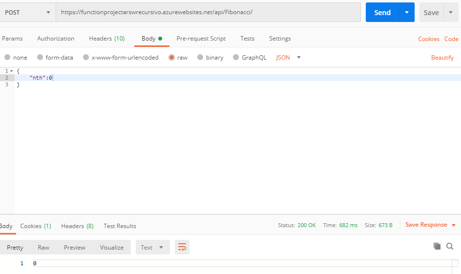

- 100

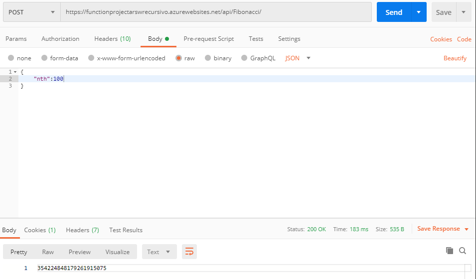

- 500

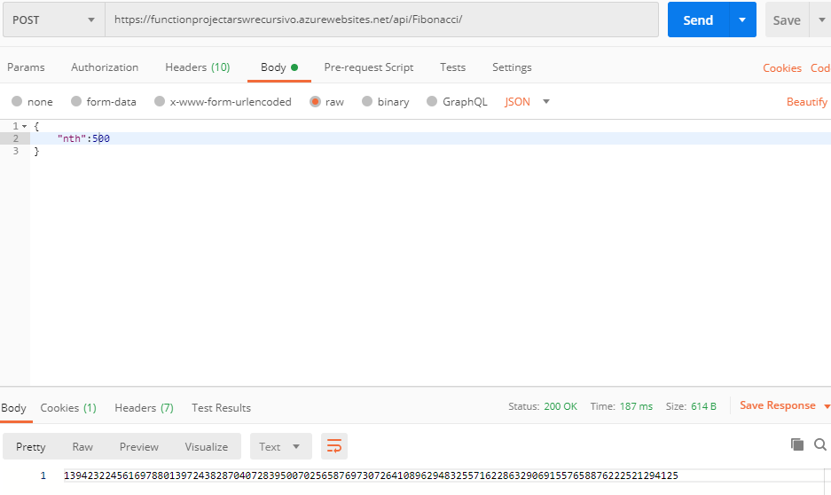

- 1000

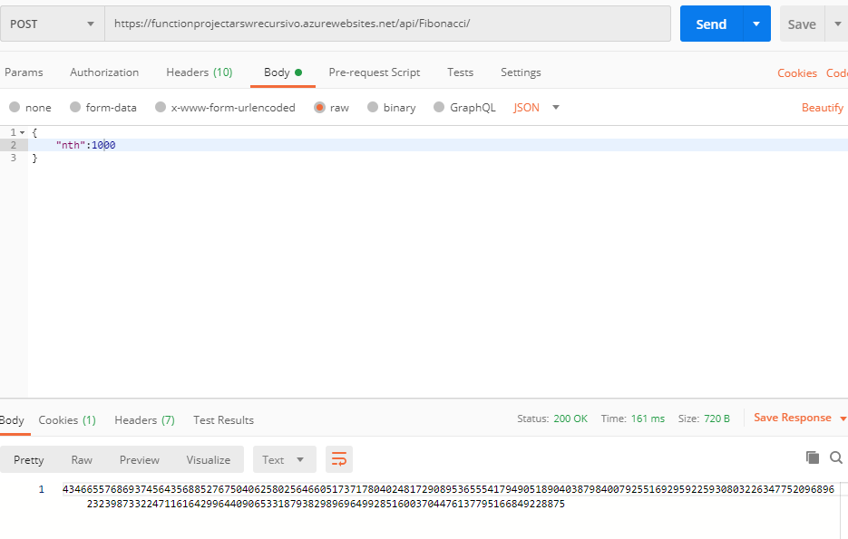

- 2000 

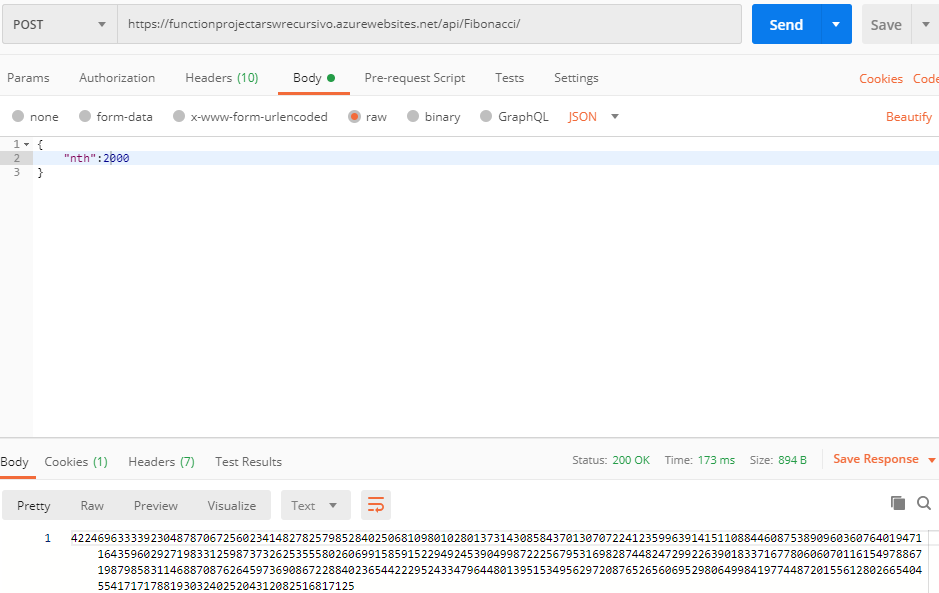

- 5000

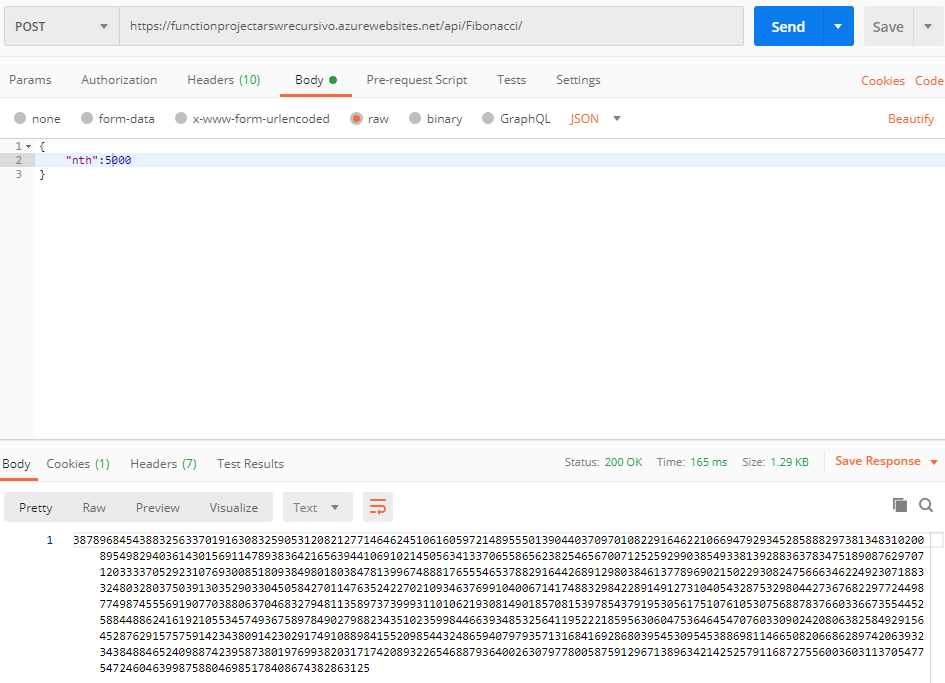

- 10000

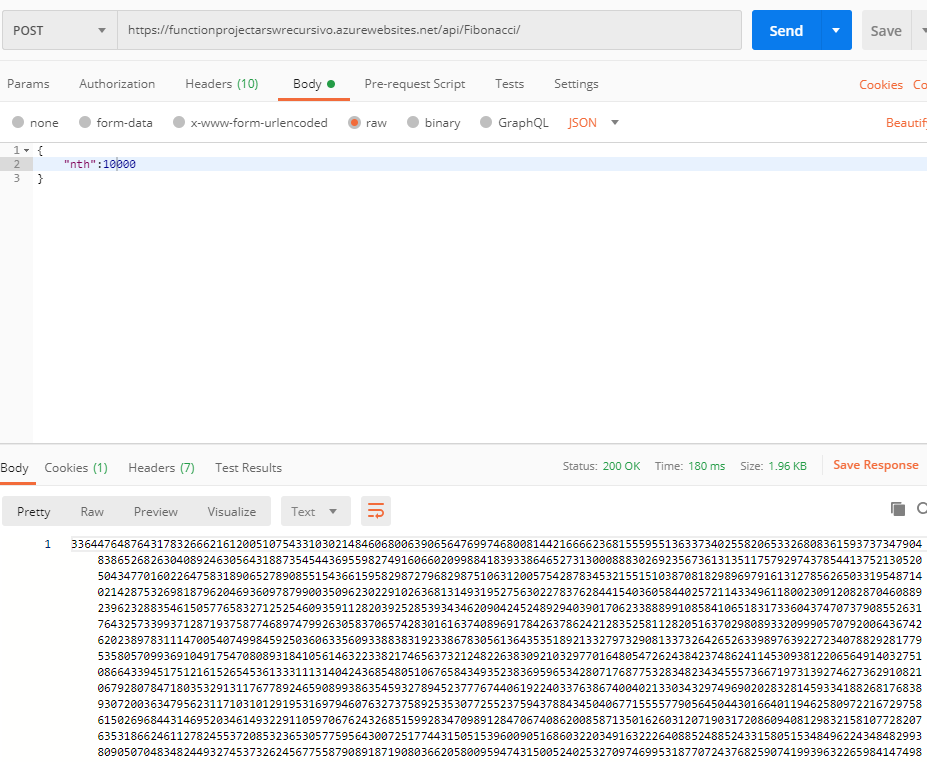

### Analisis de Resultados

Notamos que al memorizar en cache los tiempos disminuyen en una gran medida, tal asi que algunos se tienen en milisegundos.

### Conclusiones

Cuando se memoriza información se puede mejorar el tiempo de respuesta al bajar los procesos realizados.

Con esto notamos que programas sencillos podemos tener una gran reducción de tiempo, logrando llegar a milisegundos con valores muy grandes, esto nos muestra que al implemetar esto en apps mas grandes podemos mejorar significativamente su rendimiento y por tanto llegar a mejorar la experiencia de usuario. Asi mismo se debe tener en cuenta que no es necesario memorizar toda información de cualquier app, se debe hacer un reconocimiento y estudio de a que información es mejor aplicarle este tipo de soluciones.

