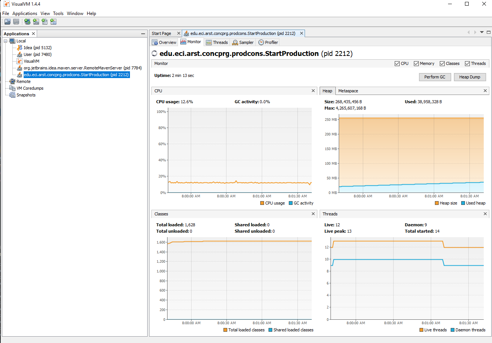
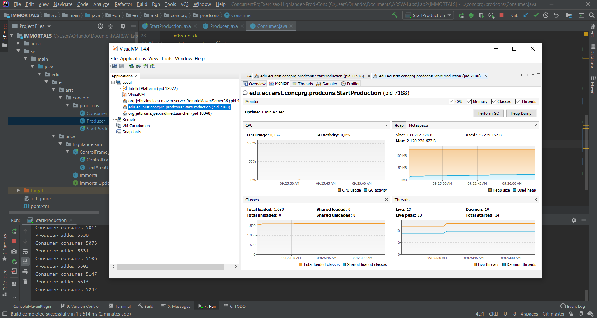
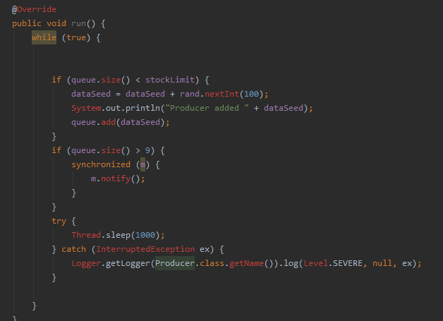
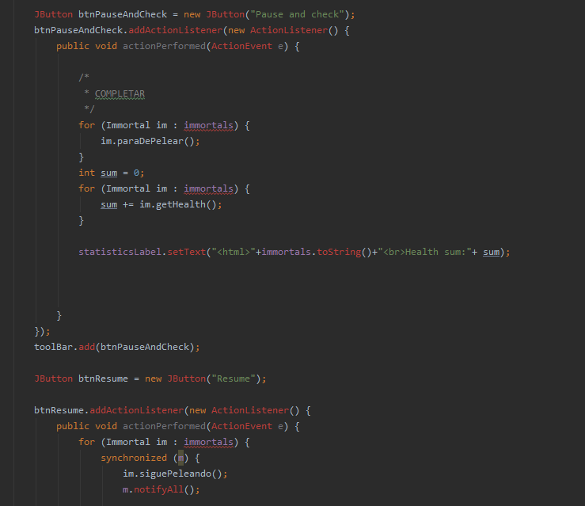
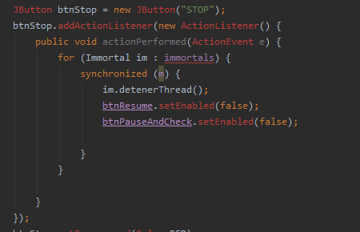
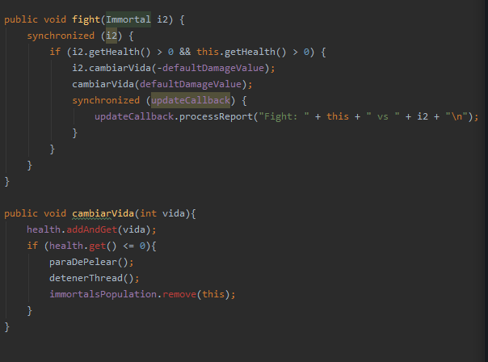

# ARSW-Labs

## Compilar y ejecutar

Para compilar: mvn package

Para ejecutar la clase principal: mvn exec:java -Dexec.mainClass="edu.eci.arsw.threads.MainCanodromo"

                                  mvn exec:java -Dexec.mainClass="edu.eci.arsw.primefinder.Main"

# Lab02 (Immortal Case)

1. **Part I - Before finishing class**

1 - Revisar la operación y ejecutarla, usar jVisualVM para revisar el uso de recursos.

2 - Realizar ajustes para mejorar la eficiencia del uso de CPU.

3 - Hacer el productor mas eficiente

2. **Part II**

- Para N jugadores, la invariante es 100*N ya que cada jugador tiene 100 de vida inicial

- Al implementarse los botones Pause and Check y Resume no se cumple la invariante

## Desarrollado con:

* [Maven](https://maven.apache.org/) - Dependency Management
* [JAVA](https://www.java.com/es/download) - Framework
* [JDK](https://www.oracle.com/technetwork/java/javase/downloads/jdk8-downloads-2133151.html) - Framework

## Autores:

* **Orlando Antonio Gelves Kerguelen**  [orlandoagk](https://github.com/orlandoagk)
* **Jimmy Andres Moya Suarez**  [Jmjimmy20](https://github.com/Jmjimmy20)

