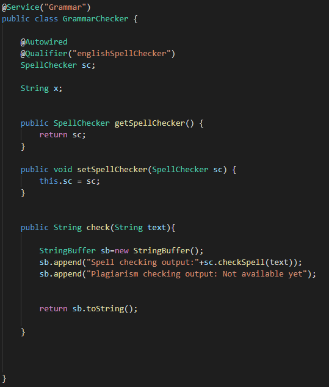
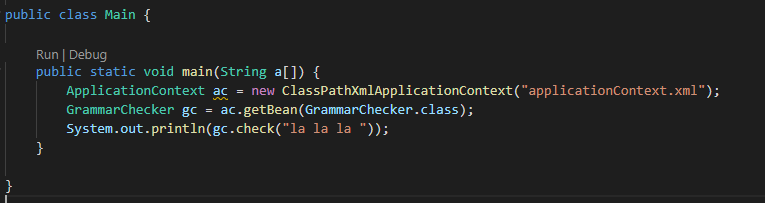

# ARSW-Labs

# Lab03 

1. **Part I - Basic workshop**

1 - Haciendo uso de la configuración spring basada en anotaciones , maruqe usando @Autowired y @Service

2 - Haga un programa de prueba, donde Spring crea una instancia de GrammarChecker, y úsela

