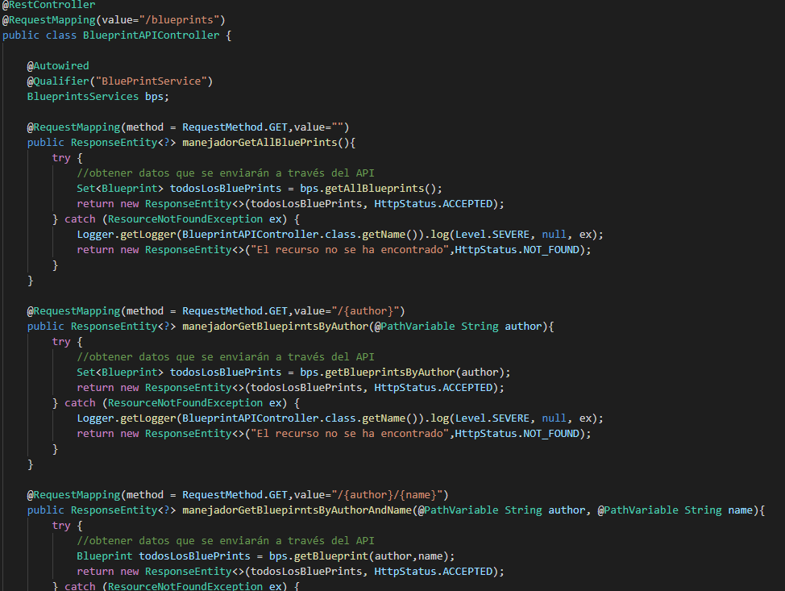
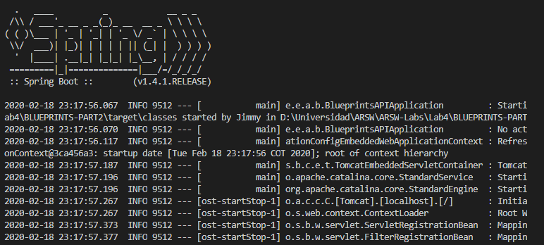
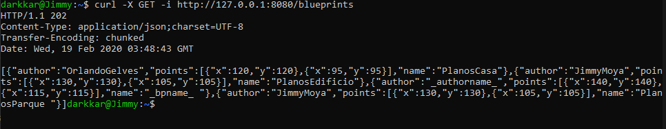
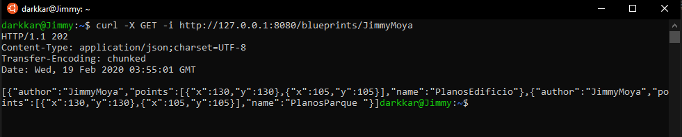
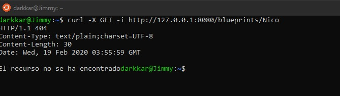
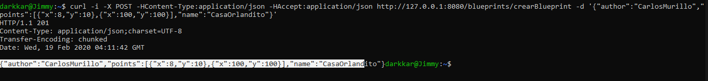
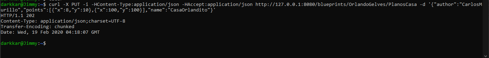

# ARSW-Lab 04

## Parte 1

- Modifique la clase BlueprintAPIController

- Verifique el funcionamiento de a aplicación lanzando la aplicación con maven

## Parte 2

- POr Autor

- 404

- POST

- PUT

## Parte 3 

- Qué condiciones de carrera se podrían presentar?
    - Realizar un PUT y GET sobre el mismo Blueprint al mismo tiempo
    - Modificar la misma Blueprint en dos instancias al mismo tiempo
- Cuales son las respectivas regiones críticas?
    - Blueprints HashMap

## Desarrollado con:

* [Maven](https://maven.apache.org/) - Dependency Management
* [JAVA](https://www.java.com/es/download) - Framework
* [JDK](https://www.oracle.com/technetwork/java/javase/downloads/jdk8-downloads-2133151.html) - Framework

## Autores:

* **Orlando Antonio Gelves Kerguelen**  [orlandoagk](https://github.com/orlandoagk)
* **Jimmy Andres Moya Suarez**  [Jmjimmy20](https://github.com/Jmjimmy20)

