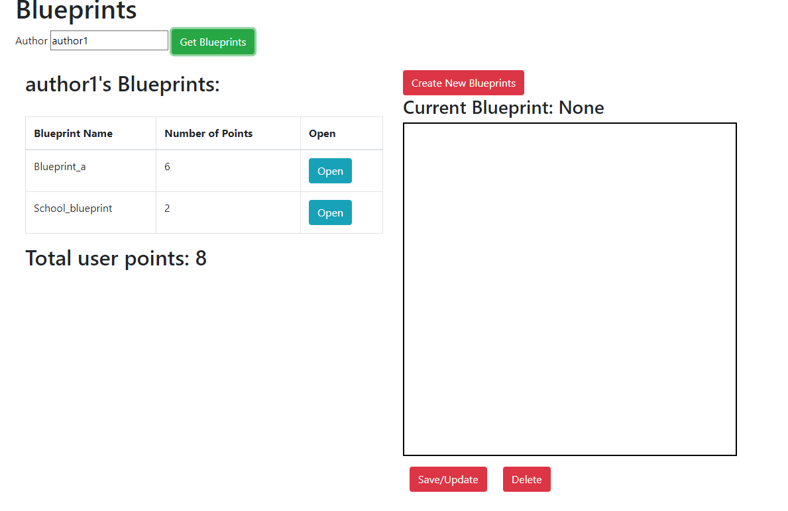
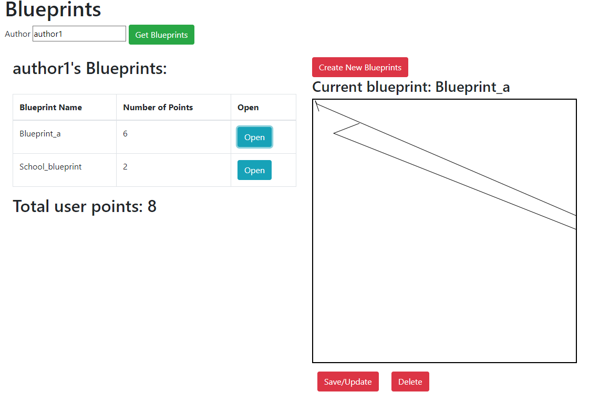
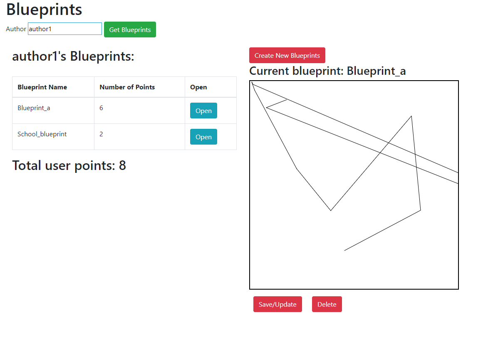
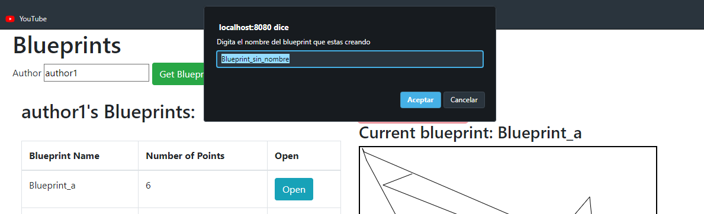
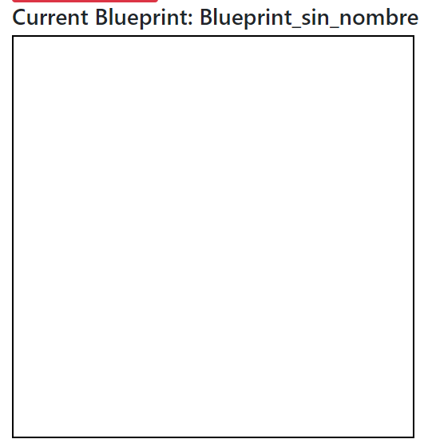

# ARSW-Lab 06

- Ejecución: gradle bootRun
- URL: http://localhost:8080
- Autores para test: author1 y author2

#### Cargar "Author"

####Abrir blueprint

####Añadir nuevos puntos a partir de clicks

####Crear nuevo Blueprint

####Se crea nuevo Blueprint a partir del nombre puesto

## Desarrollado con:

* [Maven](https://maven.apache.org/) - Dependency Management
* [JAVA](https://www.java.com/es/download) - Framework
* [JDK](https://www.oracle.com/technetwork/java/javase/downloads/jdk8-downloads-2133151.html) - Framework

## Autores:

* **Orlando Antonio Gelves Kerguelen**  [orlandoagk](https://github.com/orlandoagk)
* **Jimmy Andres Moya Suarez**  [Jmjimmy20](https://github.com/Jmjimmy20)

