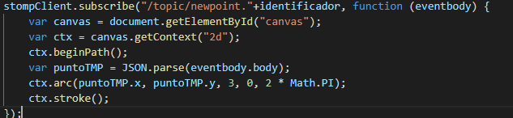
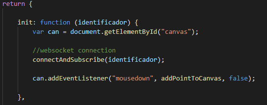
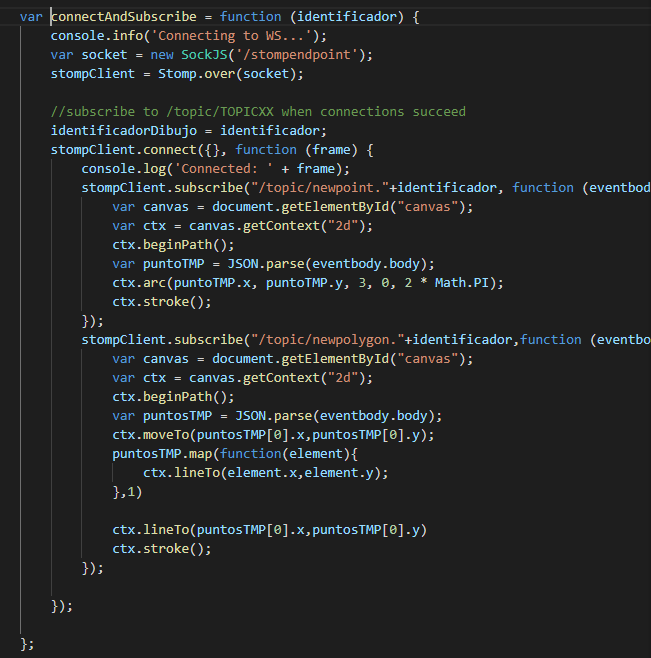

# ARSW-Lab 07

Este ejercicio se basa en la documentación oficial de SprinbBoot, para el manejo de WebSockets con STOMP.
En este repositorio se encuentra una aplicación SpringBoot que está configurado como Broker de mensajes, de forma similar a lo mostrado en la siguiente figura:

## Primera y segunda parte

## Tercera parte

## Desarrollado con:

* [Maven](https://maven.apache.org/) - Dependency Management
* [JAVA](https://www.java.com/es/download) - Framework
* [JDK](https://www.oracle.com/technetwork/java/javase/downloads/jdk8-downloads-2133151.html) - Framework

## Autores:

* **Orlando Antonio Gelves Kerguelen**  [orlandoagk](https://github.com/orlandoagk)
* **Jimmy Andres Moya Suarez**  [Jmjimmy20](https://github.com/Jmjimmy20)

