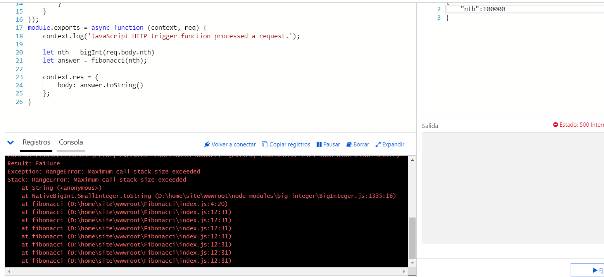
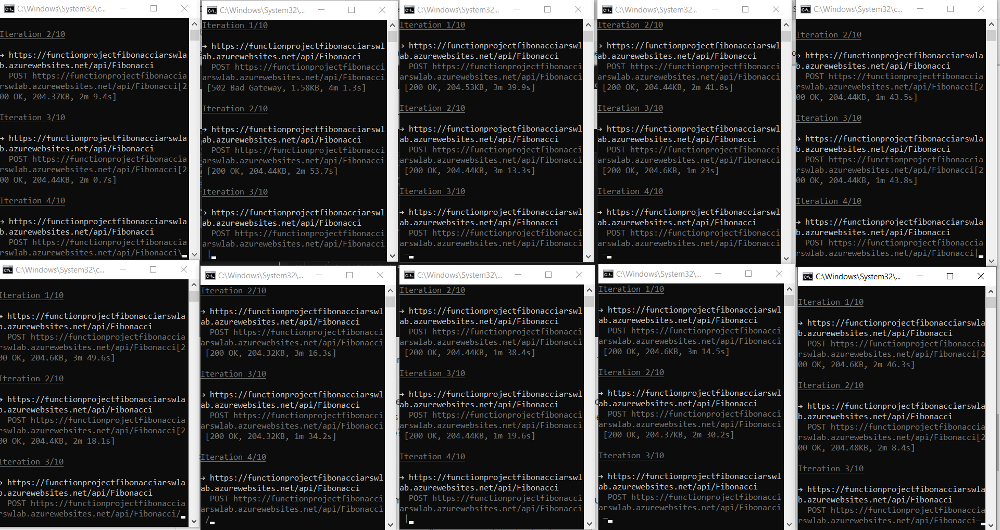

### Escuela Colombiana de Ingeniería
### Arquitecturas de Software - ARSW

## Escalamiento en Azure con Maquinas Virtuales, Sacale Sets y Service Plans

### Dependencias
* Cree una cuenta gratuita dentro de Azure. Para hacerlo puede guiarse de esta [documentación](https://azure.microsoft.com/en-us/free/search/?&ef_id=Cj0KCQiA2ITuBRDkARIsAMK9Q7MuvuTqIfK15LWfaM7bLL_QsBbC5XhJJezUbcfx-qAnfPjH568chTMaAkAsEALw_wcB:G:s&OCID=AID2000068_SEM_alOkB9ZE&MarinID=alOkB9ZE_368060503322_%2Bazure_b_c__79187603991_kwd-23159435208&lnkd=Google_Azure_Brand&dclid=CjgKEAiA2ITuBRDchty8lqPlzS4SJAC3x4k1mAxU7XNhWdOSESfffUnMNjLWcAIuikQnj3C4U8xRG_D_BwE). Al hacerlo usted contará con $200 USD para gastar durante 1 mes.

### Parte 0 - Entendiendo el escenario de calidad

Adjunto a este laboratorio usted podrá encontrar una aplicación totalmente desarrollada que tiene como objetivo calcular el enésimo valor de la secuencia de Fibonnaci.

**Escalabilidad**
Cuando un conjunto de usuarios consulta un enésimo número (superior a 1000000) de la secuencia de Fibonacci de forma concurrente y el sistema se encuentra bajo condiciones normales de operación, todas las peticiones deben ser respondidas y el consumo de CPU del sistema no puede superar el 70%.

### Escalabilidad Serverless (Functions)

1. Cree una Function App tal cual como se muestra en las  imagenes.

2. Instale la extensión de **Azure Functions** para Visual Studio Code.

3. Despliegue la Function de Fibonacci a Azure usando Visual Studio Code. La primera vez que lo haga se le va a pedir autenticarse, siga las instrucciones.

4. Dirijase al portal de Azure y pruebe la function.

5. Modifique la coleción de POSTMAN con NEWMAN de tal forma que pueda enviar 10 peticiones concurrentes. Verifique los resultados y presente un informe.

Pondremos el informe más abajo en la sección de preguntas (ultimo numeral)

6. Cree una nueva Function que resuleva el problema de Fibonacci pero esta vez utilice un enfoque recursivo con memoization. Pruebe la función varias veces, después no haga nada por al menos 5 minutos. Pruebe la función de nuevo con los valores anteriores. ¿Cuál es el comportamiento?.

Realizamos el experimento correspondiente de forma recursiva usando memorización pero el programa se estalla con el caso 100.000 y nos da una excepción RangeError: Maximum call stack size exceeded por lo cual adjuntaremos el código pero optaremos por usar una solución iterativa con memorización.
Adjunto el código para la prueba recursiva con memorización.

Error con recursión usando el valor de 1'000.000

Como vemos en la solución recursiva con memorización nos da un error el cual nos dice que el stack de llamados se excedió, pero básicamente siguiendo las instrucciones del ejercicio con esta implementación siempre funciona igual con casos bajos lo que si podemos recalcar es el tiempo de ejecucción ya que la memorización permite que sea bastante eficiente con respecto al tiempo pero por la restricción con respecto al stack de llamados preferimos cambiar de solución como planteamos anteriormente.

Adjunto el código para prueba de la memorización iterativa

Al probar varias veces la primera vez se demoro calculando 100.000 (no pudimos probar con 1'000.000 ya que el código se demora mucho en ejecutarse así que decidimos bajarlo), pero cuando empezamos a usar valores menores a 100.000 la función retorna casi enseguida el resultado esto fue probado con los siguientes valores 999.999, 900.000, 800.000 y 7500.

Siguiendo con las instrucciones dejamos de hacer peticiones por más de 5 minutos y cuando volvimos a realizar la petición con 100.000 esta se demoro y tuvo que calcularse de nuevo, por ende podemos decir que el caché de la función se limpia aproximadamente cada 5 minutos, despues de probar con ese 100.000 volvemos al comportamiento nuevamente de calcular numeros menores casi enseguida.

**Preguntas**

* ¿Qué es un Azure Function?
    - Es una solución para ejecutar fácilmente pequeños fragmentos de código o “funciones” en la nube sin preocuparse de la infraestructura de la aplicación; la infraestructura dn la nube proporciona los servidores necesarios para un buen funcionamiento a escala.
* ¿Qué es serverless?
    - Serverless o informática sin servidor se refiere a un modelo de cloud computing en el que los desarrolladores de aplicaciones no tienen que implementar servidores ni gestionar la escalabilidad de sus aplicaciones. En su lugar, el proveedor de nube abstrae esas tareas rutinarias para que los desarrolladores puedan crear códigos para la producción más rápido que en los modelos tradicionales.
* ¿Qué es el runtime y que implica seleccionarlo al momento de crear el Function App?
    - Runtime: Runtime es el tiempo de ejecucion una tarea, puede ser un programa completo o una función.
    - En Azure functions el runtime permite experimentar estas sin necesidad de comprometerse con la nube, así mismos,  el codigo o funciones aue crees estara disponible en la nube.
    - Esto implica que que una parte de la aplicacion se correra en maquinas locales, esta caracteristica nos mermitenejecutar procesos por lotes en horas especificas entre otras cosas.

* ¿Por qué es necesario crear un Storage Account de la mano de un Function App?
    -   La cuenta de almacenamiento proporciona un espacio de nombres único para sus datos de Azure Storage al que se puede acceder desde cualquier lugar del mundo a través de HTTP o HTTPS, esto nos otorga mas seguridad en los proyectos o desarrollos, asi mismo esta cuenta contiene todos los objetos de datos de Azure Storage como blobs, archivos, entre otros.

* ¿Cuáles son los tipos de planes para un Function App?, ¿En qué se diferencias?, mencione ventajas y desventajas de cada uno de ellos.
    - Azure nos ofrece 2 opciones grandes, la primera es adquiriendo planes, esotos de dividen en free, shared, basic, standar, premium e isolate; a continuación vemos la imagen de los planes.
    
    
    
* ¿Por qué la memoization falla o no funciona de forma correcta?
	- La impelemtanción recursiva con memorización fallo debido a que la cantidad de procesos que estamos realizando es muy alta, la memorización colabora a reducir algunos de estos pero aun así se siguen necesitando muchos procesos por lo cual no es una solución óptima para este ejercicio. 
    - La implementación iterativa usando memorización no fallo, solamente se borra cuando no se ejecuta la función dentro de 5 minutos.
* ¿Cómo funciona el sistema de facturación de las Function App?
    - 
* Informe

Ejecutamos newman con una nueva colección la cual se llama Lab9 y contiene una consulta a la API de la función la cual usa el metodo POST y envía en el cuerpo de la data una variable llamada nth con valor de 1'000.000, lo que haremos para que funcione concurrentemente es ejecutarla 10 veces en una consola diferente cada una, mantremos un número de 10 iteraciones por petición para así poder sacar un número promedio más acertado.

Como vemos en la imagen de abajo ya estamos ejecutando los comandos y hasta ahora no hemos visto ningún problema en los casos por ende por ahora podemos deducir que esta opción de Azure Functions nos cumple con la premisa de no tener que preocuparnos por la infraestructura, lo que si estamos viendo hasta ahora en comparación con la solución del laboratorio pasado es que los tiempos se elevaron casi 3 veces pero no concluimos nada hasta tener el resultado de las tablas.

Después de que terminaron tenemos las 10 tablas que nos dió newman cada una por cada consulta (para mayor entendimiento estas fueran enumeradas), ahora procedemos a ver los datos de las tablas para poder concluir algo, estas tablas las adjuntaré enseguida.

Como vemos tenemos un tiempo promedio de respuesta 2:30 minutos lo cual es 4 veces más alto que el tiempo de respuesta promedio de la solución del anterior laboratorio teniendo un minimo tiempo promedio de 1:25 minutos y un tiempo máximo de casi 4 minutos. Respecto a los tiempos vemos que esta no es una solución muy optima para este problema de Fibonacci pero cabe recalcar que el despliegue de la función es MUY rapido casi enseguida lo que no pasaba con las maquinas virtuales del anterior laboratiorio que tenian un inicio promedio de 40 segundos, también cabe recalcar en estas pruebas que ninguna iteración de ninguna petición fallo lo cual no sucedió con la primera prueba del laboratorio pasado (la que nos tocó escalar verticalmente).

Podemos concluir que esta solución de funciones puede ser muy eficente para operaciones que no necesiten mucho procesamiento ya que con respecto a maquinas virtuales se quedan muy atras en caunto a tiempo de ejecucción, además de que el rápido despliegue de estas mismas nos permitirá probrar mucho más rápido funciones de nuestros algoritmos.
